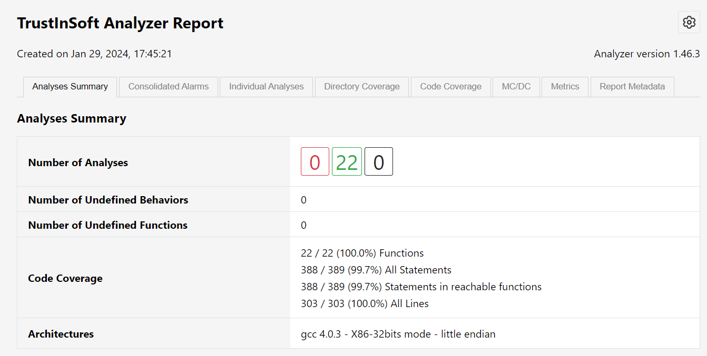

<!--
trustinsoft/demos
Copyright (C) 2024 TrustInSoft
mailto:contact AT trust-in-soft DOT com

This program is free software; you can redistribute it and/or
modify it under the terms of the GNU Lesser General Public
License as published by the Free Software Foundation; either
version 3 of the License, or (at your option) any later version.

This program is distributed in the hope that it will be useful,
but WITHOUT ANY WARRANTY; without even the implied warranty of
MERCHANTABILITY or FITNESS FOR A PARTICULAR PURPOSE. See the GNU
Lesser General Public License for more details.

You should have received a copy of the GNU Lesser General Public License
along with this program; if not, write to the Free Software Foundation,
Inc., 51 Franklin Street, Fifth Floor, Boston, MA  02110-1301, USA.
-->

# Demo tis-autosar-mockup for automatic AUTOSAR Classic Applications analysis

This demo how the TrustInSoft `tis-autosar-mockup` integration tool automatically generates all the analysis configuration and
analysis drivers for an AUTOSAR Application from the sole AUTOSAR ARXML file in order to analyze the application fully automatically

When using an AUTOSAR Authoring tool, the main output of the tool is:
- The AUTOSAR application itself, as a `.c` file. In our case [AP_Hello_World.c](AP_Hello_World.c)
- A bunch of C header files, in our case in the [rte_runtime](rte_runtime) and [AP_Hello_World](AP_Hello_World) directories
- The ARXML files that describes the AUTOSAR Application, in particular RTE primitives, all types and input ranges of the application

The `tis-autosar-mockup` tool takes the ARXML as input and generates:
- RTE mocks as a C file
- The TrustInSoft Analyzer configuration

Once `tis-autosar-mockup` has been run, and generated the entire analysis environment, the TrustInSoft Analyzer can be run automatically without any human intervention.

## Running the AUTOSAR Classic integration tool

Simply execute `make gen`:
```bash
$ make gen
tis-autosar-mockup --arxml test.arxml \
   --rte-header AP_Hello_World/Rte_AP_Hello_World.h \
   --output-dir .trustinsoft \
   -- -Irte_runtime -IAP_Hello_World
WARNING:__main__:Unsupported category UNION for type unionImpl
WARNING:__main__:Absent or unsupported array semantic for type variableArrayImpl.
WARNING:__main__:Could not find a relevant COM-SPEC for port prototype <PORT-PROTOTYPE-REF DEST="PR-PORT-PROTOTYPE">/ComponentTypes/AP_Hello_World/SimpleNvDataPort</PORT-PROTOTYPE-REF>
                           and element <TARGET-DATA-PROTOTYPE-REF DEST="VARIABLE-DATA-PROTOTYPE">/PortInterfaces/SimpleNvDataInterface/element_OneToTen</TARGET-DATA-PROTOTYPE-REF>

WARNING:__main__:Could not parse AutosarDataType for argument 'arg'
WARNING:__main__:Could not extract arguments for operation 'UnionCInterface'
The AUTOSAR mock generation is complete. Generation summary:
In the software component 'AP_Hello_World', the following runnable(s) were detected:
 - 'ArrayRunable'
 - 'BooleanRunnable'
 - 'ComplexArrayRunable'
 - 'ComplexRxRunnable'
 - 'DataConstraintRunnable'
 - 'DoubleRunnable'
 - 'DReadRunnable'
 - 'DTCServiceRunnable'
 - 'ExplicitReadByValue'
 - 'FeedbackRunnable'
 - 'Hello_World_Runnable'
 - 'ImpliciteWrite'
 - 'ImplicitReadRunnable'
 - 'InterVariableRunnable'
 - 'IsUpdatedRunnable'
 - 'ModeRunnable'
 - 'MultipleInstanciationRunnable'
 - 'ReceiveRecordRunnable'
 - 'ServiceRunnable'
 - 'StructRunable'
 - 'TriggerRunnable'
 - 'UnionRunnable'

A total of 133 RTE mock(s) have been generated.
```

The execution takes a handful of seconds. All the data for automatic TrustInSoft Analyzer execution
has been produced in the `.trustinsoft` directory. 22 analysis drivers have been defined.

## Running TrustInSoft Analyzer

Running the 22 analysis drivers defined by the `tis-autosar-mockup` tool is now as simple as running the command `make tis`:

```bash
$ make tis
tis-analyzer -tis-config-load .trustinsoft/generated_config.json -tis-config-select 22 -tis-report 
...
tis-analyzer -tis-config-load .trustinsoft/generated_config.json -tis-config-select 22 -tis-report -tis-report-directory .trustinsoft/results -save .trustinsoft/save/AP_Hello_World_UnionRunnable.save

[kernel] Loading configuration file .trustinsoft/generated_config.json (analysis #22)
...
[info] Saved dead block information in '.trustinsoft/results/AP_Hello_World_UnionRunnable_dead_blocks.csv'
[info] Saved JSON results in '.trustinsoft/results/AP_Hello_World_UnionRunnable_results.json'
[time] Performance summary:
  Parsing: 2.466s
  Value Analysis: 0.208s

  Total time: 0h00m02s (= 2.674 seconds)
  Max memory used: 136.7MB (= 136708096 bytes)
ETA: 0s Left: 0 AVG: 0.36s  local:0/22/100%/0.5s
Compiling report from 22 past executed tests
tis-report .trustinsoft/results/ --skip-file rte_mocks.c
information: using analysis .trustinsoft/results/AP_Hello_World_ArrayRunable_results.json
...
information: using analysis .trustinsoft/results/AP_Hello_World_UnionRunnable_results.json
The report has been generated in tis_report.html

Check generated test report tis_report.html
```

The TrustInSoft Analyzer HTML report shows how exhaustive the analysis was:
- 22 analysis drivers were generated and executed
- 100% of functions and 99.7% of statements of the application were covered



## Tuning the analysis

The `tis-autosar-mockup` generates analysis drivers with a default configuration that can be manually
adjusted if need be, for instance to:
- Balance execution time vs precision (reduce false positives)
- Select embedded target, since AUTOSAR application typically run on MCU based on specific hardware targets
- Etc...

This manual tuning is optional, incremental and persisted from one `tis-autosar-mockup` execution to the
other, in the `.trustinsoft/permanent_config.json` file. Any edit of this file is preserved by the tool.

## Conclusion

In this demo we have shown how the `tis-autosar-mockup` tool allows to automatically analyze
an AUTOSAR Classic application without any user intervention.
The tool can automatically generate all the normally manually written analysis drivers so
that any AUTOSAR application can benefit from the exhaustive analysis of TrustInSoft Analyzer,
that provides mathematical guarantee of absence of Undefined Behaviors in the AUTOSAR Application code.

Reach out to us through https://trust-in-soft.com/contact/ if you would like to know more about our product.

*Copyright (C) 2022-2023 TrustInSoft*
