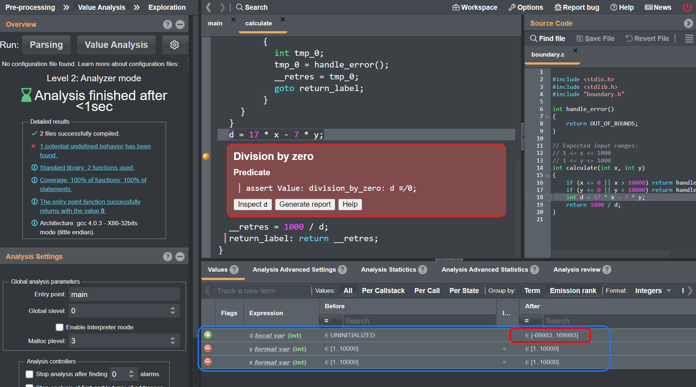

<!--
# trustinsoft/demos
# Copyright (C) 2022-2023 TrustInSoft
# mailto:contact AT trust-in-soft DOT com
#
# This program is free software; you can redistribute it and/or
# modify it under the terms of the GNU Lesser General Public
# License as published by the Free Software Foundation; either
# version 3 of the License, or (at your option) any later version.
#
# This program is distributed in the hope that it will be useful,
# but WITHOUT ANY WARRANTY; without even the implied warranty of
# MERCHANTABILITY or FITNESS FOR A PARTICULAR PURPOSE. See the GNU
# Lesser General Public License for more details.
#
# You should have received a copy of the GNU Lesser General Public License
# along with this program; if not, write to the Free Software Foundation,
# Inc., 51 Franklin Street, Fifth Floor, Boston, MA  02110-1301, USA.
-->

# Why boundary testing is not always sufficient to detect problems such as Undefined Behaviors?

## Overview

This directory demonstrates why boundary testing may not be a sufficient way to detect specific values
that may cause problems such as division by zero in you code.

Note: If you have an Ubuntu machine you can run this demo live by running:
```bash
git clone https://github.com/TrustInSoft/trustinsoft/demos
cd boundary-testing
./demo.sh
```

## Let's do boundary testing

In the hope of detecting corner cases we want to do boundary testing of the `calculate()` function below. See [boundary.c](boundary.c) for details
```c
// Special value return when input is out of bounds (value not in regular output space)
#define OUT_OF_BOUNDS   0xCAFECAFE
// Expected input ranges:
// 1 <= x <= 10000
// 1 <= y <= 10000
int calculate(int x, int y)
{
    if (x < 1 || x > 10000) return OUT_OF_BOUNDS;
    if (y < 1 || y > 10000) return OUT_OF_BOUNDS;
    int d = 17 * x - 7 * y;
    return 10000 / d;
}
```
In order to try to be comprehensive we will have to test a rather large number of combinations for `x` and `y`:
- Within the boundaries
- Around the boundaries
```
// expected inputs: 1 ≤ x ≤ 10000, 1 ≤ y ≤ 10000
(-3,-3)       (0, -3)    ...
(-3, 0)       (0, 0)     ...
(-3, 1)       (0, 1)     ...
(-3, 5000)    (0, 5000)   ...
(-3, 10000)   ...
(-3, 10001)   ...
(-3, 20000)   ...
```
We will test this `calculate()`function with the following test driver. See [test_driver.c](test_driver.c) for details
```c
#define SUCCESS "PASSED"
#define FAILED  "*** FAILED ***"
int main()
{
    int inputs[] = {
        -3,-3,        0, -3,        -3, 0,      0, 0,
        -3, 1,        0, 1,         -3, 500,    0, 500
        -3, 1000,     -3, 1001,     -3, 2000,   1, 1000,
        1000, 1000,   1001, 1000,   1001, 7,    7, 7
    };
    int len = sizeof(inputs)/sizeof(int);

    printf("\nRun test_calculate()\n");
    int res;
    for (int i = 0; i < len-1; i += 2) {
        int x = inputs[i];
        int y = inputs[i+1];
        res = calculate(x, y);
        printf("calculate(%5d, %5d) = ", x, y);
        if (res == OUT_OF_BOUNDS) {
            printf("OUT_OF_BOUNDS --> %s\n",
               (x < 1 || x > 1000 || y < 1 || y > 1000) ? SUCCESS: FAILED); 
        } else {
            printf("%8d      --> %s\n", res,
               (x >= 1 && x <= 1000 && y >= 1 && y <= 1000) ? SUCCESS: FAILED);
        }
    }
    return 0;
}
```
The execution of the above yields the following
```bash
$ make 
gcc -I. -fprofile-arcs -ftest-coverage test_driver.c boundary.c -o boundary-test && ./boundary-test

Run test_calculate()
calculate(   -3,    -3) = OUT_OF_BOUNDS --> PASSED
calculate(    0,    -3) = OUT_OF_BOUNDS --> PASSED
calculate(   -3,     0) = OUT_OF_BOUNDS --> PASSED
calculate(    0,     0) = OUT_OF_BOUNDS --> PASSED
calculate(   -3,     1) = OUT_OF_BOUNDS --> PASSED
calculate(    0,     1) = OUT_OF_BOUNDS --> PASSED
calculate(   -3,  5000) = OUT_OF_BOUNDS --> PASSED
calculate(    0,  5000) = OUT_OF_BOUNDS --> PASSED
calculate(   -3, 10000) = OUT_OF_BOUNDS --> PASSED
calculate(   -3, 10001) = OUT_OF_BOUNDS --> PASSED
calculate(   -3, 20000) = OUT_OF_BOUNDS --> PASSED
calculate(    1, 10000) =        0      --> PASSED
calculate(10000, 10000) =        0      --> PASSED
calculate(10001, 10000) = OUT_OF_BOUNDS --> PASSED
calculate(10001,     7) = OUT_OF_BOUNDS --> PASSED
calculate(    7,     7) =       14      --> PASSED
gcov boundary.c
File 'boundary.c'
Lines executed:100.00% of 7
Creating 'boundary.c.gcov'
```
**All boundary tests pass and structural coverage is 100%.**

The above shows that boundary testing has several limitations:
- As exhaustive as this input list may be, we have a good chance to not select one set of inputs that could reveal the problem in the `calculate()` function, like x == 119 and y == 289 for instance.
- Even if luckily (accidentally) we chose one input vector that can fail the test, this will be an isolated case and will not guarantee
that all possible combinations that can fail the test are found.
- It would take 10000 x 10000 = 100 millions tests to test all the possible valid input values.

**Despite the boundary testing efforts, there is an undefined behavior (a division by zero) that was not detected by the tests.**

You may argue that in this example a smart tester should look at the code and determine that some special values may cause a division by zero.
That's true but:
- Sometimes testers may not have access to the code implementation so they can't guess special values
- This example is fairly simple to "reverse engineer" and deduct special values, but in real life code may be way more complex with conditions,
subfunction calls etc... which would make a tester's life much more difficult to find out special values.

## Analyzing the above code with TrustInSoft

In order to deterministically and exhaustively detect Undefined Behaviors (Division by Zero in our case) in the code under test,
we'll now use the TrustInSoft Analyzer with generalization of inputs.
The test driver is modified as below (by the way see how generalization make things simple)
```c
int main()
{
    int x = tis_interval(INT_MIN, INT_MAX);
    int y = tis_interval(INT_MIN, INT_MAX);
    int res = calculate(x, y);
    return 0;
}
```

Now let's run the TrustInSoft Analysis

```
$ make tis
tis-analyzer -val-profile analyzer -val -I. test_driver.c boundary.c$
[kernel] [1/6] Parsing TIS_KERNEL_SHARE/libc/__fc_builtin_for_normalization.i (no preprocessing)
[kernel] [2/6] Parsing TIS_KERNEL_SHARE/libc/tis_runtime.c (with preprocessing)
[kernel] [3/6] Parsing TIS_KERNEL_SHARE/__tis_mkfs.c (with preprocessing)
[kernel] [4/6] Parsing TIS_KERNEL_SHARE/mkfs_empty_filesystem.c (with preprocessing)
[kernel] [5/6] Parsing test_driver.c (with preprocessing)
[kernel] [6/6] Parsing boundary.c (with preprocessing)
[kernel] Successfully parsed 2 files (+4 runtime files)
[value] Analyzing a complete application starting at main
[value] Computing initial state
[value] Initial state computed
[value] The Analysis can be stopped by hitting Ctrl-C
[value] using specification for function tis_interval
boundary.c:37:[kernel] warning: division by zero: assert d ≢ 0;
                  stack: calculate :: test_driver.c:59 <- main
[value] Done for function main
[time] Performance summary:
  Parsing: 2.411s
  Value Analysis: 0.059s

  Total time: 0h00m02s (= 2.470 seconds)
  Max memory used: 140.3MB (= 140304384 bytes)
```
The division by zero is well detected.
To investigate which value can cause the division by zero, you may launch the Analyzer GUI. You would get something like the below.



A quick inspection of values of `x` and `y` when computing `d` shows that `x` and `y` are well in the expected [1, 10000] bounds, i.e. despite feeding any integer value from `INT_MIN` to `INT_MAX`, the previous lines of code filtering out values below 1 and above 10000 was effective.

Inspecting the range of possible values for `d` given `x` and `y` between 1 and 10000 shows that `d` can be between **-69983** and **169993**.
The value **0** is therefore possible and will cause a division by zero in the next line when computing `10000 / d`

The division by zero is well detected.

## Conclusion

- Boundary testing is certainly a right thing to do but may not prove sufficient when inputs values that can cause problems happen
"randomly" within the input range and not close to the bounds.
- Testing all possible input values within the possible input space often proves impossible when the size of the input space is too large (in our example above the input space for 2 integers between 1 and 10000 has a size of 100 millions possibilities).

The TrustInSoft analyzer solves the above problems with its level 2 generalization capability:
- Exhaustively and deterministically detecting all Undefined Behaviors caused by specific input values that can be anywhere in the input range
- Performing the equivalent of billions of billions of tests when the possible input space is very large

Reach out to us through https://trust-in-soft.com/contact/ if you would like to know more about our product.

*Copyright (C) 2022-2023 TrustInSoft*
