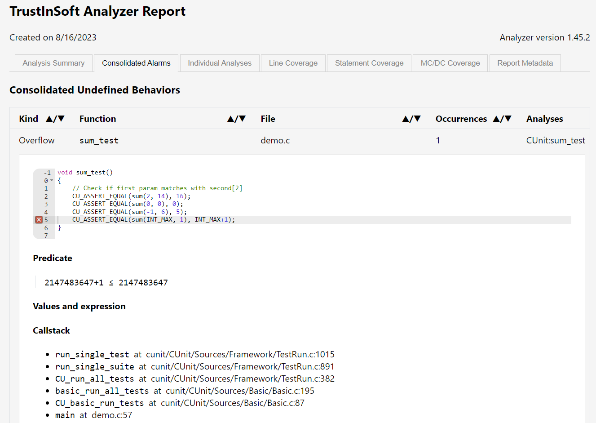

<!--
trustinsoft/demos
Copyright (C) 2023 TrustInSoft
mailto:contact AT trust-in-soft DOT com

This program is free software; you can redistribute it and/or
modify it under the terms of the GNU Lesser General Public
License as published by the Free Software Foundation; either
version 3 of the License, or (at your option) any later version.

This program is distributed in the hope that it will be useful,
but WITHOUT ANY WARRANTY; without even the implied warranty of
MERCHANTABILITY or FITNESS FOR A PARTICULAR PURPOSE. See the GNU
Lesser General Public License for more details.

You should have received a copy of the GNU Lesser General Public License
along with this program; if not, write to the Free Software Foundation,
Inc., 51 Franklin Street, Fifth Floor, Boston, MA  02110-1301, USA.
-->

# Demo of TrustInSoft Analyzer / CUnit integration

This demo demonstrates how it could be quite simple to replay CUnit tests with TrustInSoft Analyzer (in Level 1
Interpreter mode) and that such re-run is likely to detect problems that remain unnoticed with CUnit.

:warning: This repository is a proof of concept to show the feasibility but full cunit integration support
would be only available upon request from our customers.

<!--
Note: If you have an Ubuntu machine you can run this demo live by running:
```bash
git clone https://github.com/TrustInSoft/trustinsoft/demos
cd cunit-integration
./demo.sh
``` 
-->

## Setup

In order to run this demo you must first install CUnit library and sources. This is easily done by running:
```bash
git clone https://github.com/TrustInSoft/trustinsoft/demos
cd cunit-integration
make prepare
```

This has to be done only once for all.

## CUnit test suite

The code to be tested is the `sum()` function located in [demo.c](demo.c#L18) source file.

For the sake of simplicity (and even if that is probably not a good practice), the CUnit test
suite is defined in the same file (see [demo.c line 22 onwards](demo.c#L22))

```c
int sum(int a, int b) {
    return (long)a+(long)b;
}

void sum_test()
{
    // Check if first param matches with second[2]
    CU_ASSERT_EQUAL(sum(2, 14), 16);
    CU_ASSERT_EQUAL(sum(0, 0), 0);
    CU_ASSERT_EQUAL(sum(-1, 6), 5);
    CU_ASSERT_EQUAL(sum(INT_MAX, 1), INT_MAX+1);
}

int main()
{
    // Initialize CUnit Test Suite
    if (CUE_SUCCESS != CU_initialize_registry())
        return CU_get_error();
    CU_basic_set_mode(CU_BRM_VERBOSE);
    CU_pSuite pSuite = CU_add_suite("sum_test_suite", 0, 0);
    if (NULL == pSuite) {
        CU_cleanup_registry();
        return CU_get_error();
    }
    if (NULL == CU_add_test(pSuite, "sum_test", sum_test)) {
        CU_cleanup_registry();
        return CU_get_error();
    }

    // Run the tests and show the run summary
    CU_basic_run_tests();
    return CU_get_error();
}
```

## Running CUnit Test Suite

Once you have done `make prepare` to install **CUnit**,
you can simply run the CUnit test suite by executing `make cunit`.
You should see something like:
```
$ make cunit
gcc demo.c -o demo -lcunit && ./demo


     CUnit - A unit testing framework for C - Version 2.1-3
     http://cunit.sourceforge.net/


Suite: sum_test_suite
  Test: sum_test ...passed

Run Summary:    Type  Total    Ran Passed Failed Inactive
              suites      1      1    n/a      0        0
               tests      1      1      1      0        0
             asserts      4      4      4      0      n/a

Elapsed time =    0.000 seconds
```

From the CUnit report you can see that there was 1 test and 4 assertions ran and **they all pass**.

## Running the same CUnit tests with TrustInSoft Analyzer

In order to run the same tests with TrustInSoft Analyzer, the analyzer needs:
- The CUnit headers
- The CUnit source code

The simple solution to that is to fetch the **CUnit** source code from its repository.
This is achieved by running `make prepare` that downloads all the sources under the local `cunit` directory.

The list of includes and C sources paths needed for the analysis is provided through the [tis.json](tis.json#L7)
configuration file. (see `files` and `cpp-extra-args` parameters)

Onc ethe above is done, we're all set to run TISA: `make clean tis-l1`
```
$ make clean tis-l1

make clean tis-l1
Cleaning...
tis-analyzer -kernel-msg-key pp -tis-config-load tis.json -tis-report -tis-config-select 1
[kernel] Loading configuration file tis.json (analysis #1)
...
[kernel] Successfully parsed 6 files (+4 runtime files)
[value] Analyzing a complete application starting at main
[value] Computing initial state
[value] Initial state computed
[value] The Analysis can be stopped by hitting Ctrl-C
cunit/CUnit/Sources/Framework/TestDB.c:672:[value] Cannot evaluate range bound strlen{Old}(s2)
        (unsupported ACSL construct: logic functions or predicates). Approximating
cunit/CUnit/Sources/Framework/TestDB.c:794:[value] Cannot evaluate range bound strlen{Old}(s2)
        (unsupported ACSL construct: logic functions or predicates). Approximating

     CUnit - A unit testing framework for C - Version @VERSION@-@RELEASE@
     http://cunit.sourceforge.net/


[value] using specification for function clock

Suite: sum_test_suite


  Test: sum_test ...
[value] using specification for function setjmp
TIS_KERNEL_SHARE/libc/setjmp.h:44:[value] warning: no \from part for clause 'assigns *(env+(0 .. 4));' of function setjmp
TIS_KERNEL_SHARE/libc/setjmp.h:45:[value] warning: no 'assigns \result \from ...' clause specified for function setjmp
demo.c:28:[kernel] warning: signed overflow. assert 2147483647+1 ≤ 2147483647;
                  stack: sum_test :: cunit/CUnit/Sources/Framework/TestRun.c:1015 <-
                         run_single_test :: cunit/CUnit/Sources/Framework/TestRun.c:891 <-
                         run_single_suite :: cunit/CUnit/Sources/Framework/TestRun.c:382 <-
                         CU_run_all_tests :: cunit/CUnit/Sources/Basic/Basic.c:195 <-
                         basic_run_all_tests :: cunit/CUnit/Sources/Basic/Basic.c:87 <-
                         CU_basic_run_tests :: demo.c:57 <-
                         main
demo.c:28:[value] completely invalid value in evaluation of
        argument tmp_2 == 2147483647 + 1
[from] Non-terminating function sum_test (no dependencies)
...
[value] using specification for function CU_number_width
[value] Semantic level unrolling superposing up to 100 states
[value] Semantic level unrolling superposing up to 200 states
[value] Semantic level unrolling superposing up to 400 states
[value] Semantic level unrolling superposing up to 900 states
[value] Semantic level unrolling superposing up to 1800 states
...
[time] Performance summary:
  Parsing: 3.696s
  Value Analysis: 11.923s

  Total time: 0h00m15s (= 15.619 seconds)
  Max memory used: 640.0MB (= 640024576 bytes)
===============================================
       1 UNDEFINED BEHAVIORS FOUND
===============================================
Compiling report from 1 past executed tests
information: using analysis .trustinsoft/results/CUnit:sum_test_results.json

Check generated test report tis_report.html
```

As you can see, the Analyzer has detected an **integer overflow** that was not detected by the CUnit tests.

```
demo.c:28:[kernel] warning: signed overflow. assert 2147483647+1 ≤ 2147483647;
```

This overflow is also found with all details in the produced [HTML report](.static/tis_report.l2.html)



## Conclusion

functional tests are quite useful to verify the functional behavior of the code, but not really its robustness. TrustInSoft analyzer is an excellent complement to also bring mathematical guarantee of robustness (absence of undefined behaviors)

Running tests with CUnit is certainly of high value because it allows to verify that function outputs
are the expected values for particular inputs.
However it may not detect Undefined Behaviors if they don't have a direct impact on the output.
It's therefore very interesting to re-run the same CUnit tests with the TrustInSoft Analyzer to detect them,
and the nice thing is that re-running CUnit tests with TrustInSoft is almost effortless.
It works almost automatically.

Reach out to us through https://trust-in-soft.com/contact/ if you would like to know more about our product.

*Copyright (C) 2023 TrustInSoft*
