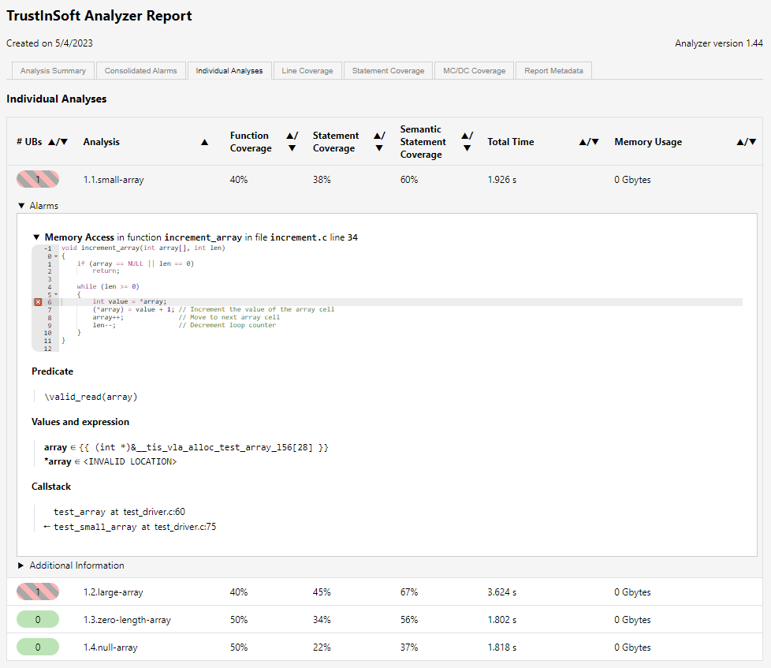
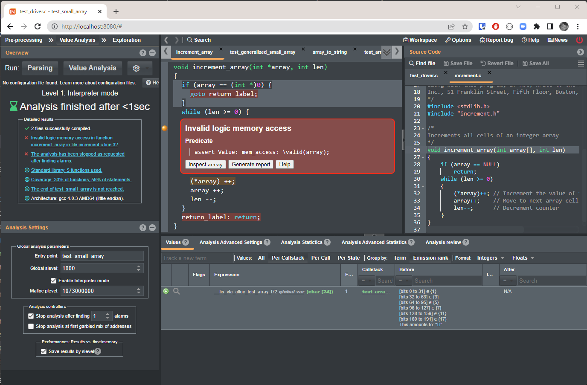
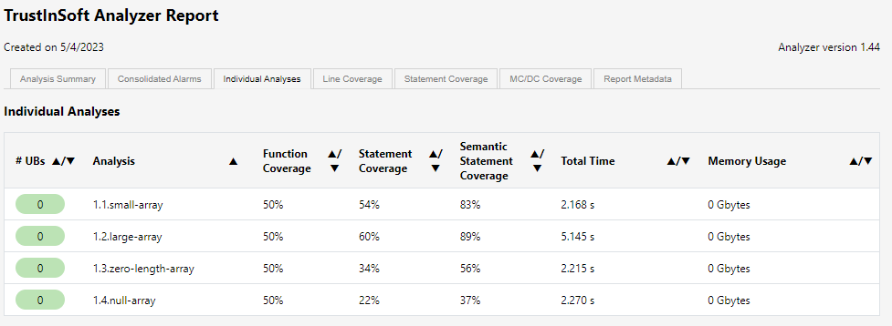
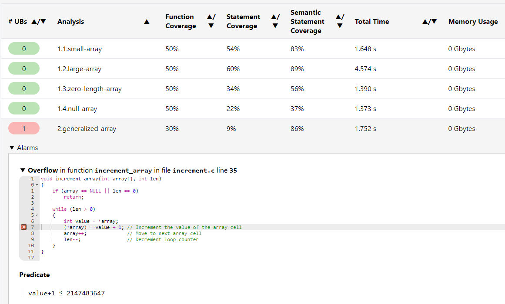

<!--
trustinsoft/demos
Copyright (C) 2022-2023 TrustInSoft
mailto:contact AT trust-in-soft DOT com

This program is free software; you can redistribute it and/or
modify it under the terms of the GNU Lesser General Public
License as published by the Free Software Foundation; either
version 3 of the License, or (at your option) any later version.

This program is distributed in the hope that it will be useful,
but WITHOUT ANY WARRANTY; without even the implied warranty of
MERCHANTABILITY or FITNESS FOR A PARTICULAR PURPOSE. See the GNU
Lesser General Public License for more details.

You should have received a copy of the GNU Lesser General Public License
along with this program; if not, write to the Free Software Foundation,
Inc., 51 Franklin Street, Fifth Floor, Boston, MA  02110-1301, USA.
-->

# Demo of buffer overflow/array out of bounds detection

This demo demonstrates:
- How unit tests can typically miss undefined behaviors like buffer overflows or integer overflows if those undefined behaviors do not cause immediate problems (like a crash), and
- How TrustInSoft analysis detects them with mathematical guarantee.

Note: If you have an Ubuntu machine you can run this demo live by running:
```bash
git clone https://github.com/TrustInSoft/trustinsoft/demos
cd new-demo
./demo.sh
``` 

## Code under test

The code to be tested is the [increment.c](increment.c#L26) source file.

This file has only one function `increment_array(int array[], int len)` that takes an array of integer (and its length) as input and increments by 1 all integers in the array.
The code of `increment_array()` is the following:
```c
void increment_array(int array[], int len)
{
    if (array == NULL || len == 0)
        return;
    while (len >= 0)
    {
        int value = *array;
        (*array) = value + 1; // Increment the value of the array cell
        array++;              // Move to next array cell
        len--;                // Decrement loop counter
    }
}
```

## Unit tests

The test driver [test_driver.c](test_driver.c#L71) has several unit tests meant to test that function.
- Test with small array of a few static integers
- Test with a larger array (1000 cells) of random integers
- Test with an empty array
- Test with an null (unallocated) array

When running the 4 unit tests, they all pass, and on top of that the code coverage is 100%. This can be verified by running `make clean test`
```
$ make clean test

gcc -I. -fprofile-arcs -ftest-coverage test_driver.c utils.c increment.c -o increment && ./increment

Running unit tests
PASSED: increment_array({1, 3, 5, 7, 11, 17}) = {2, 4, 6, 8, 12, 18}
PASSED: increment_array({846930886, 1714636915, 424238335, -1649760492, -1189641421, ..., -878777377, -531352976, 413892161, 1455252833}) = {846930887, 1714636916, 424238336, -1649760491, -1189641420, ..., -878777376, -531352975, 413892162, 1455252834}
PASSED: increment_array({}) = {}
PASSED: increment_array(NULL) = NULL

---> All tests PASSED

gcov increment.c
File 'increment.c'
Lines executed:100.00% of 7
Creating 'increment.c.gcov'
```

Despite the above passing tests (and the 100% code coverage) we'll see that there are undetected undefined behaviors (or UB below in this document), more specifically a **buffer overflow**... and also an **integer overflow**

## Level 1 analysis - Replay existing unit tests

Level 1 analysis with TrustInSoft is really easy because it simply consists in replaying the unit tests with the TrustInSoft analyzer instead of the Unit Test framework. In the current case the [Makefile](makefile) is preparing the quite simple commands to run the 4 tests so it only requires to run `make tis-l1`.

You need to have the TrustInSoft analyzer installed to successfully run this command. If you don't you can see the output below (uninteresting parts of the output log have been stripped)

```
$ make tis-l1
tis-analyzer -tis-config-load trustinsoft/tis.json -tis-report -tis-config-select-by-name 1.2.large-array
[kernel] Loading configuration file trustinsoft/tis.json (analysis "1.2.large-array")
...
[kernel] [5/7] Parsing increment.c (with preprocessing)
[kernel] [6/7] Parsing test_driver.c (with preprocessing)
[kernel] [7/7] Parsing utils.c (with preprocessing)
[kernel] Successfully parsed 3 files (+4 runtime files)
[value] Analyzing a complete application starting at test_large_array
...
increment.c:34:[kernel] warning: out of bounds read. assert \valid_read(array);
                  stack: increment_array :: test_driver.c:60 <-
                         test_array :: test_driver.c:84 <-
                         test_large_array
...
[time] Performance summary:
  Parsing: 1.342s
  Value Analysis: 1.901s
  
  Total time: 0h00m03s (= 3.243 seconds)
  Max memory used: 308.0MB (= 308076544 bytes)

tis-analyzer -tis-config-load trustinsoft/tis.json -tis-report -tis-config-select-by-name 1.3.zero-length-array
[kernel] Loading configuration file trustinsoft/tis.json (analysis "1.3.zero-length-array")
[kernel] Configuration successfully loaded.
...
[kernel] [5/7] Parsing increment.c (with preprocessing)
[kernel] [6/7] Parsing test_driver.c (with preprocessing)
[kernel] [7/7] Parsing utils.c (with preprocessing)
[kernel] Successfully parsed 3 files (+4 runtime files)
[value] Analyzing a complete application starting at test_zero_length
...
PASSED: increment_array({}) = {}
...
[time] Performance summary:
  Parsing: 1.317s
  Value Analysis: 0.035s
  
  Total time: 0h00m01s (= 1.351 seconds)
  Max memory used: 140.3MB (= 140304384 bytes)

tis-analyzer -tis-config-load trustinsoft/tis.json -tis-report -tis-config-select-by-name 1.4.null-array
[kernel] Loading configuration file trustinsoft/tis.json (analysis "1.4.null-array")
...
[kernel] [5/7] Parsing increment.c (with preprocessing)
[kernel] [6/7] Parsing test_driver.c (with preprocessing)
[kernel] [7/7] Parsing utils.c (with preprocessing)
...
PASSED: increment_array(NULL) = NULL
...
[time] Performance summary:
  Parsing: 1.336s
  Value Analysis: 0.033s
  
  Total time: 0h00m01s (= 1.369 seconds)
  Max memory used: 140.3MB (= 140304384 bytes)

tis-analyzer -tis-config-load trustinsoft/tis.json -tis-report -tis-config-select-by-name 1.1.small-array
[kernel] Loading configuration file trustinsoft/tis.json (analysis "1.1.small-array")
...
[kernel] [5/7] Parsing increment.c (with preprocessing)
[kernel] [6/7] Parsing test_driver.c (with preprocessing)
[kernel] [7/7] Parsing utils.c (with preprocessing)
[kernel] Successfully parsed 3 files (+4 runtime files)
[value] Analyzing a complete application starting at test_small_array
...
increment.c:34:[kernel] warning: out of bounds read. assert \valid_read(array);
                  stack: increment_array :: test_driver.c:60 <-
                         test_array :: test_driver.c:75 <-
                         test_small_array
...
[time] Performance summary:
  Parsing: 1.336s
  Value Analysis: 0.035s
  
  Total time: 0h00m01s (= 1.371 seconds)
  Max memory used: 140.3MB (= 140304384 bytes)
===============================================
       2 UNDEFINED BEHAVIORS FOUND
===============================================
Compiling report from 4 past executed tests
information: using analysis ./trustinsoft/results/1.1.small-array_results.json
information: using analysis ./trustinsoft/results/1.2.large-array_results.json
information: using analysis ./trustinsoft/results/1.3.zero-length-array_results.json
information: using analysis ./trustinsoft/results/1.4.null-array_results.json

Check generated test report tis_report.html
```

As you can witness, 2 undefined behaviors have been found. Actually it's the same undefined behavior revealed by 2 different analyses,
the size of the array making no difference for that problem, both the small array and large array analyses find the same undefined behavior.
(Note: For convenience the HTML analysis report deduplicates multiple occurences of the same undefined behaviour)

The below log section pinpoints at where the undefined behavior is found
```
increment.c:34:[kernel] warning: out of bounds read. assert \valid_read(array);
                  stack: increment_array :: test_driver.c:60 <-
                         test_array :: test_driver.c:75 <-
                         test_small_array
```
That (the logs), plus the [HTML report](.static/tis_report.l1.html) generated by the analysis may be sufficient for the developer to understand what the problem is: In this particular case the array is incremented 1 cell past the end of the array, because of a wrong loop termination condition.



If that is not the case, one of the tests that detected an UB can be re-executed in GUI mode, where the developer will have access to a full investigation interface to understand the root cause of the problem and the potential fix.
See below a screenshot of this interface on the particular UB.



The analyzers points at an out of bounds write. In the calling functions (`test_small_array()`, `test_large_array()`), it has recorded the size of the array (variable depending on the considered test), and when, in the `increment()` function, the pointer that iterates on the cells of the arrays increments one cell too far, it detects that `(*array)++` writes out of the bounds of the array.

After investigation of the problem, one should conclude that the problem comes from the loop end condition.
The code is looping 1 time to much (e.g. 8 loops for an array of 7 integer)
It should be `while (len > 0)` instead of `while (len >= 0)`.

If we fix the code and re-run the 4 unit tests with the TrustInSoft Analyzer, all 4 analyses succeed and demonstrate absence of Undefined Behaviors with the considered inputs (4 differents inputs), See the updated [HTML report](.static/tis_report.l1-no-ub.html)



## Level 2 analysis - Input generalization

Now that Level 1 unit tests are proven to have no undefined behaviors (for the discrete test input values), we can now make our analyses more exhaustive, and generalize the inputs to a much larger input set that the 4 (hopefully smart) values used for unit tests. This is what is called Level 2 analysis.

For that, we generalize the array to any possible array values up to the given array size.
We have chosen a limit of array of 1000 integers. That's **(2^32)^1000 different values** (assuming integers on 32 bits) !
The way we do that is by using one specific TrustInSoft Analyzer built-in primitive called `tis_make_unknown`. This specifies
that the (formal) variable `input_array`can contain anything (for the whole size of the variable, in our case 4000 bytes)

There are many other analyzer built-in primitives that allow all sorts of different generalizations (interval of values for numbers,
pointer null or not, etc..., See [Documentation](https://man.trust-in-soft.com/search.html#abstract-values)

The very simple generalized test code is the following (see source code at [test_driver.c](test_driver.c#L102)):
```c
void test_generalized_large_array()
{
    int input_array[1000];
    int len = sizeof(input_array)/sizeof(int);
    tis_make_unknown(input_array, sizeof(input_array));
    increment_array(input_array, len);
    return;
}
```

The Level 2 generalized test can be run with `make tis-l2`. You need to have the TrustInSoft Analyzer installed to run this command successfully. If you don't, the output is given below (some uninteresting logs may have been stripped out).

```
tis-analyzer -tis-config-load trustinsoft/tis.json -tis-report -tis-config-select-by-name 2.1.generalized-small-array
[kernel] Loading configuration file trustinsoft/tis.json (analysis "2.generalized-array")
...
[kernel] [5/7] Parsing increment.c (with preprocessing)
[kernel] [6/7] Parsing test_driver.c (with preprocessing)
[kernel] [7/7] Parsing utils.c (with preprocessing)
...
increment.c:35:[kernel] warning: signed overflow. assert value+1 ≤ 2147483647;
                  stack: increment_array :: test_driver.c:107 <- test_generalized_array
....
[time] Performance summary:
  Parsing: 1.358s
  Value Analysis: 0.488s
  
  Total time: 0h00m01s (= 1.847 seconds)
  Max memory used: 173.8MB (= 173858816 bytes)
===============================================
       1 UNDEFINED BEHAVIORS FOUND
===============================================
Compiling report from 5 past executed tests

Check generated test report tis_report.html
```

As you can see, the generalization of input has revealed 1 additional undefined behaviors, not found by discrete unit tests. It's an **integer overflow** as quickly highlighted by the log:
```
increment.c:35:[kernel] warning: signed overflow. assert value+1 ≤ 2147483647;
                  stack: increment_array :: test_driver.c:107 <- test_generalized_array
```
If that is not sufficient to understand the problem, the developer may have a look at the [HTML report](.static/tis_report.l2.html) or even launch the GUI for more dynamic investigation.



Anyhow, the root cause here is that when an array cell contains the value `INT_MAX`, i.e. `2147483647` on the defined target, trying to increment it will cause an undefined behavior. A special treatment should be implemented for this value.

## Conclusion

In this demo we have shown a relatively common situation where pretty well defined Unit Tests, all passing and producing 100% of code coverage, have missed Undefined behaviors.
- By replaying these Unit Tests with the TrustInSoft analyzer we were able to detect a first Undefined Behavior (a **buffer overflow**)
- By further generalizing inputs, we were able to detect a second Undefined Behavior (an **integer overflow**)

Unit Tests are quite useful to verify the functional behavior of the code, but not really it's robustness. TrustInSoft analyzer is an excellent complement to also bring mathematical guarantee of robustness (absence of undefined behaviors)

Reach out to us through https://trust-in-soft.com/contact/ if you would like to know more about our product.

*Copyright (C) 2022-2023 TrustInSoft*
