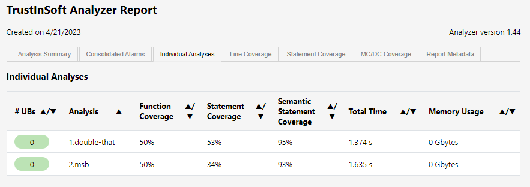
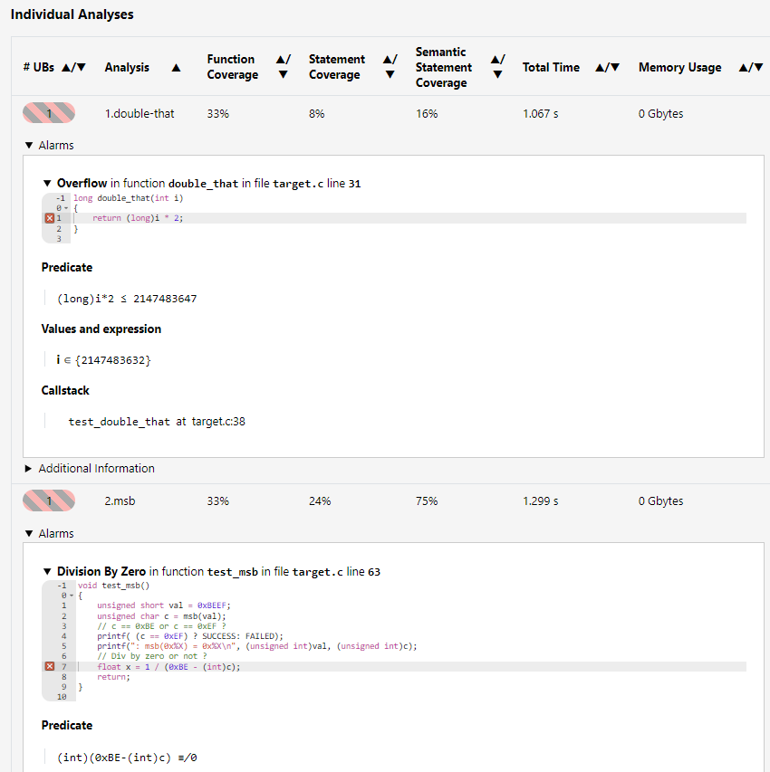

<!--
trustinsoft/demos
Copyright (C) 2023 TrustInSoft
mailto:contact AT trust-in-soft DOT com

This program is free software; you can redistribute it and/or
modify it under the terms of the GNU Lesser General Public
License as published by the Free Software Foundation; either
version 3 of the License, or (at your option) any later version.

This program is distributed in the hope that it will be useful,
but WITHOUT ANY WARRANTY; without even the implied warranty of
MERCHANTABILITY or FITNESS FOR A PARTICULAR PURPOSE. See the GNU
Lesser General Public License for more details.

You should have received a copy of the GNU Lesser General Public License
along with this program; if not, write to the Free Software Foundation,
Inc., 51 Franklin Street, Fifth Floor, Boston, MA  02110-1301, USA.
-->

# Demo of target awareness of TrustInSoft analyzer

This demo demonstrates:
- Why target awareness is important when doing static code analysis of low-level/embedded code.
- How TrustInSoft analyzer gracefully solves that challenge.

## Target sensitive code under test

The sample code for the demo is in the [target.c](target.c) source file.
2 functions are defined that require target awareness for precise analysis

```c
// Word size awareness
// double_that() is fine if long (64 bits) are larger than int (32 bits)
// double_that() can overflow on targets when long are same size as int (Bothg 32 bits for instance)
long double_that(int i)
{
    return (long)i * 2;
}
//-------------------------------------
// Endianness awareness
// This function would return a different byte (from the short) depending on target enddianness
unsigned char msb(unsigned short n)
{
    return *(unsigned char *)&n;
}
unsigned char c = msb(0xBEEF); // c == 0xBE or c == 0xEF ?
```

## Tests

The test driver simply calls the 2 above functions, and make use of the return value
```c
void test_msb() {
    unsigned char c = msb(0xBEEF);      // c == 0xBE or c == 0xEF ?
    float x = 1 / (0xBE - (int)c);      // Div by zero or not ?
}

void test_double_that() {
    long res = double_that(0x7FFFFFF0); // Integer overflow or no integer overflow ?
    int array[5] = {0, 1, 2, 3, 4};
    int index = res % 5;
    array[index] = 42;                  // Index out of range or not ? 
}

int main() {
    test_double_that();
    test_msb();
}
```

If we run these tests the traditional way (as a unit test on host) they both succeed, because
most hosts are x86 (little indian) 64 bits.
You can verify that with `make test`
```bash
make test
gcc -I. target.c -o target && ./target

PASSED: double_that(2147483632) = 4294967264 and array[4] = 42
PASSED: msb(0xBEEF) = 0xEF
```

## TrustInSoft analyses
You can perform the same tests replayed with the TrustInSoft Analyzer for different targets and witness how the results differ
because the code is target sensitive.
- On x86-64, the analyzer will report no problem (just like traditional tests), because on that target the code is safe
- On ARM-32, configured in big endian mode (ARM processors are bi-endian), the analyzer will report 2 issues

The analysis execution logs are below and a screenshot of the analysis for the 2 targets are available below

<div style="text-align: center;">


</div>

### x86-64
```bash
make tis-x64
tis-analyzer -tis-config-load trustinsoft/tis-x64.json -tis-report -tis-config-select-by-name 1.double-that
[kernel] Loading configuration file trustinsoft/tis-x64.json (analysis "1.double-that")
...
[kernel] [5/5] Parsing target.c (with preprocessing)

PASSED: double_that(2147483632) = 4294967264 and array[4] = 42

[value] Done for function test_double_that
...
[time] Performance summary:
  Parsing: 1.333s
  Value Analysis: 0.041s
  
  Total time: 0h00m01s (= 1.374 seconds)
  Max memory used: 140.3MB (= 140304384 bytes)

tis-analyzer -tis-config-load trustinsoft/tis-x64.json -tis-report -tis-config-select-by-name 2.msb
[kernel] Loading configuration file trustinsoft/tis-x64.json (analysis "2.msb")
...

PASSED: msb(0xBEEF) = 0xEF

[value] Done for function test_msb
...
[time] Performance summary:
  Parsing: 1.586s
  Value Analysis: 0.049s
  Max memory used: 140.3MB (= 140304384 bytes)
===============================================
       0 UNDEFINED BEHAVIORS FOUND
===============================================

Check generated analysis report tis_report.x64.html
```

### ARM32 big endian
```bash
make tis-arm32
tis-analyzer -tis-config-load trustinsoft/tis-arm32.json -tis-report -tis-config-select-by-name 1.double-that
[kernel] Loading configuration file trustinsoft/tis-arm32.json (analysis "1.double-that")
[kernel] [5/5] Parsing target.c (with preprocessing)
...
target.c:31:[kernel] warning: signed overflow. assert (long)i*2 ≤ 2147483647;
                  stack: double_that :: target.c:38 <- test_double_that
...
[time] Performance summary:
  Parsing: 1.029s
  Value Analysis: 0.038s
  Max memory used: 140.3MB (= 140304384 bytes)

tis-analyzer -tis-config-load trustinsoft/tis-arm32.json -tis-report -tis-config-select-by-name 2.msb
[kernel] Loading configuration file trustinsoft/tis-arm32.json (analysis "2.msb")
[kernel] [5/5] Parsing target.c (with preprocessing)
...

** FAILED **: msb(0xBEEF) = 0xBE

target.c:63:[kernel] warning: division by zero: assert (int)(0xBE-(int)c) ≢ 0;
                  stack: test_msb
...
[time] Performance summary:
  Parsing: 1.265s
  Value Analysis: 0.034s  
  Max memory used: 140.3MB (= 140304384 bytes)
===============================================
       2 UNDEFINED BEHAVIORS FOUND
===============================================

Check generated analysis report tis_report.arm32.html
```

## Switching targets, or analyzing for different targets

It is extremely easy to change targets (or to analyze the same code for different targets) with the TrustInSoft Analyzer.
The target is defined with a single analysis configuration parameter, that can be changed from one analysis to the other in a snap.
See the different value of the `machdep` parameter in [trustinsoft/tis-x64.json](trustinsoft/tis-x64.json) and [trustinsoft/tis-arm32.json](trustinsoft/tis-arm32.json) files.

More than 30 targets (and counting) are available preconfigured out of the box by TrustInSoft (see [online documentation](https://man.trust-in-soft.com/man/tis-user-guide/machdep.html)). If your target is not in the list, TrustInSoft can very easy add it based on the
target datasheet, something that we do on a regular basis as we "discover" new targets.


Changing targets or analyzing for several targets can be very handy in many use cases:
- You don't have your physical target yet, or want to analyze code from many machines, not all of them having access to a physical target
- Your same code is meant to be run on different target, depending on the particular deployment/application
- Your code was originally designed for a particular target but is now being progressively migrated to a new (more recent, more performant, with per price/performance) target

## Conclusion

From the code example above, one can conclude that analysing code taking into account the target is very important for embedded code.
Besides its formal-methods based exhaustive analysis capabilities, the TrustInSoft Analyzer provides all the required features to analyze
on a regular development or CI machine, embedded low level that is target target sensitive.

Reach out to us through https://trust-in-soft.com/contact/ if you would like to know more about our product.

*Copyright (C) 2023 TrustInSoft*
