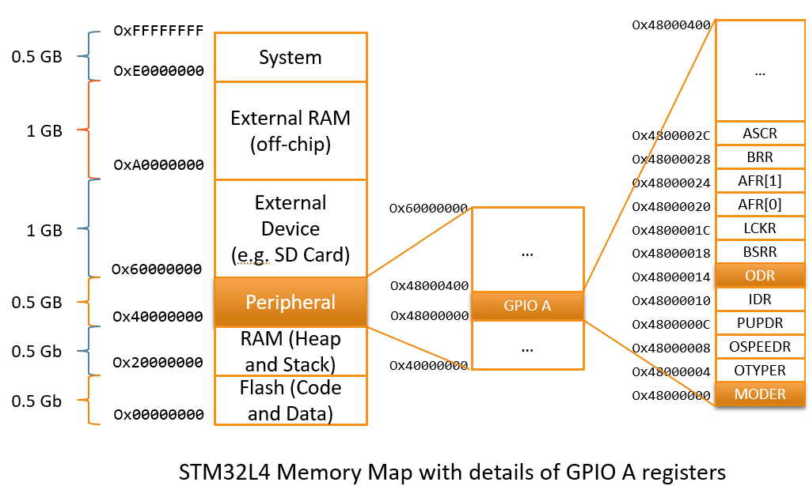
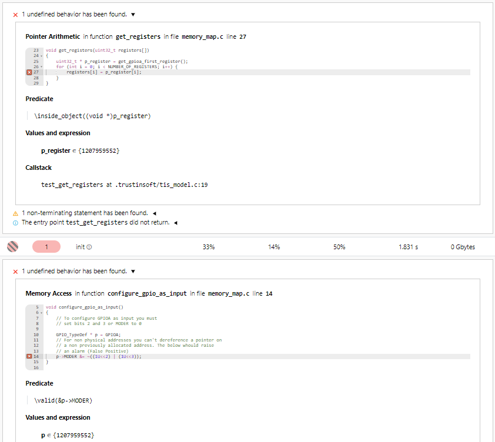
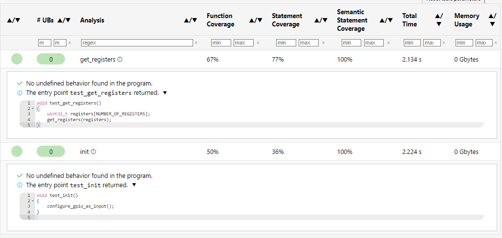
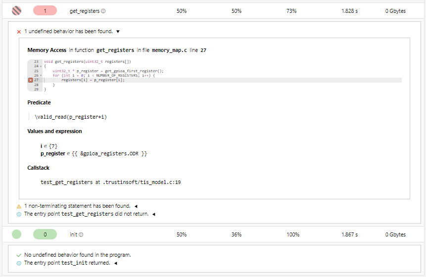

<!--
trustinsoft/demos
Copyright (C) 2024 TrustInSoft
mailto:contact AT trust-in-soft DOT com

This program is free software; you can redistribute it and/or
modify it under the terms of the GNU Lesser General Public
License as published by the Free Software Foundation; either
version 3 of the License, or (at your option) any later version.

This program is distributed in the hope that it will be useful,
but WITHOUT ANY WARRANTY; without even the implied warranty of
MERCHANTABILITY or FITNESS FOR A PARTICULAR PURPOSE. See the GNU
Lesser General Public License for more details.

You should have received a copy of the GNU Lesser General Public License
along with this program; if not, write to the Free Software Foundation,
Inc., 51 Franklin Street, Fifth Floor, Boston, MA  02110-1301, USA.
-->

# Memory mapping to eliminate False Positives and False Negatives on low-level code

This demo demonstrates the usage of the TrustInSoft Analyzer unique `tis_address()` capability.
When analyzing low level code, an analyzer that ignores the physical memory mapping is likely
to raise many False Positives and also have False Negatives.

The TrustInSoft Analyzer is aware of this memory mapping, thanks to `tis_address()` and
therefore avoids all false positives and false negatives due to memory mapping.

See  [TrustInSoft Analyzer documentation](https://man.trust-in-soft.com/man/tis-user-guide/physical-addresses.html)
for more details on `tis_address()` capabilities

## Code under analysis

The code that we want to analyze manipulates the GPIO of a given MCU (in our case the STM32L4).
For the record the memory map of STM32L4 is below, with a highlight on the Peripheral --> GPIOA --> MODER and ODR registers that will be used for the demo.



The above memory map is defined in C in [memory_map.h](memory_map.h#L23):

```c
typedef struct {
    volatile uint32_t MODER;     // Mode register
    volatile uint32_t OTYPER;    // Output type register
    volatile uint32_t OSPEEDR;   // Output speed register
    volatile uint32_t PUPDR;     // Pull-up/Pull-dow register
    volatile uint32_t IDR;       // Input data register
    volatile uint32_t ODR;       // Output data register
    volatile uint32_t BSRR;      // Bit set/reset register
    volatile uint32_t LCKR;      // Configuration lock register
    volatile uint32_t AFR[2];    // Alternate function registers
    volatile uint32_t BRR;       // Bit reset register
    volatile uint32_t ASCR;      // Analog switch control register
} GPIO_TypeDef;

#define GPIOA_START  0x48000000

#define GPIOA        ((GPIO_TypeDef *) GPIOA_START)
```

The [memory_map.c](memory_map.c) file manipulates the GPIO registers
- [configure_gpio_in_input_mode()](memory_map.c#L23) configures the GPIO in read mode (merely does `GPIOA->MODER &= ~((1U<<2) | (1U<<3));`)
- [get_gpioa_first_register()](memory_map.c#L34) returns the GPIO first register address (merely does `return &(GPIOA->MODER);`)

## Static Analysis ignoring the physical memory mapping

An analyzer that ignores the physical memory mapping would probably raise an alarm for the 2 above functions
because it is illegal to dereference an (apparently) random memory address that does not correspond to an allocated variable
(Precisely in the case of `get_gpioa_first_register()` you have to dereference the value returned by the function to get an alarm)

Those 2 alarms are actually false positives because this memory region is special (it's physically mapped)

If we run the TrustInSoft Analyzer without any `tis_address()` directives, that is exactly what happens,
we get 2 false positives.

```
$ make tis

tis-analyzer -tis-config-load .trustinsoft/config.json  -tis-config-select-by-name init
[kernel] Loading configuration file .trustinsoft/config.json (analysis "init")
...
memory_map.c:31:[kernel] warning: out of bounds write. assert \valid(&((GPIO_TypeDef *)0x48000000)->MODER);
                  stack: configure_gpio_in_input_mode :: .trustinsoft/tis_model.c:33 <-
                         test_init
...
tis-analyzer -tis-config-load .trustinsoft/config.json  -tis-config-select-by-name get_registers
...
memory_map.c:44:[kernel] warning: pointer arithmetic: assert \inside_object((void *)p_register);
                  stack: get_registers :: .trustinsoft/tis_model.c:39 <- test_get_registers
...
Check generated test report tis_report.html

===============================================
       2 UNDEFINED BEHAVIORS FOUND
===============================================
```

The TrustInSoft Analyzer report looks like the below:



## Eliminating False Positives by adding the physical memory mapping of TrustInSoft Analyzer

With one single C declaration with the special attribute **tis_address**, we can tell to the analyzer that the `0x48000000` address corresponds to the
physical address of the GPIOA registers (and that the memory region is of size `sizeof(GPIO_TypeDef)` i.e. 48 bytes)

```c
GPIO_TypeDef gpioa_registers __attribute__((tis_address(GPIOA_START)));
```

Re-running the TrustInSoft Analyzer after including this simple declaration solves the false positives.

```
$ make tis-address
tis-analyzer -tis-config-load .trustinsoft/config.json  -tis-config-select-by-name init
...
tis-analyzer -tis-config-load .trustinsoft/config.json  -tis-config-select-by-name get_registers
...
[time] Performance summary:
  Parsing: 1.857s
  Value Analysis: 0.051s

  Total time: 0h00m01s (= 1.908 seconds)
  Max memory used: 136.7MB (= 136708096 bytes)
...
Check generated test report tis_report.html

===============================================
       0 UNDEFINED BEHAVIORS FOUND
===============================================
```

Now the TrustInSoft Analyzer report does not raise any false positives:



## Eliminating False Negatives thanks to tis_address()

```c
GPIO_TypeDef gpioa_registers __attribute__((tis_address(GPIOA_START)));
```

The above `tis_address()` directive, not only indicates that `GPIO_START` (i.e. `0x48000000`) is a physically
mapped address, but also that the memory region at this address is of a well defined size, the size of the 
12 registers of the GPIO (ie 48 bytes), from `0x48000000` to `0x4800002F`)

If a pointer is defined to point to this address (or in the address range), it cannot be incremented, decremented,
or indexed in a way that would make it to point out of that range.

The [get_registers()](memory_map.c#L43) function exactly that.
```c
#define NUMBER_OF_REGISTERS 12

uint32_t * get_gpioa_first_register() {
    return &(GPIOA->MODER);
}

void get_registers(uint32_t registers[]) {
    uint32_t * gpio_registers = get_gpioa_first_register();
    for (int i = 0; i < NUMBER_OF_REGISTERS; i++)
        registers[i] = gpio_registers[i];
}
```
Since the loop remains within the address range of GPIO registers, the TrustInSoft Analyzer does not raise any alarm.

Now let's suppose that a bug exist in the code of `get_gpioa_first_register()` because it does not return the
first register address (i.e the base address of the GPIOA registers)

```c
uint32_t * get_gpioa_first_register() {
    return &(GPIOA->ODR);
}
```

A static analyzer ignoring the physical memory mapping would not complain from the code of `get_register()`
even though the loop on the 12 register would flow out of the GPIOA registers address range.
That is a serious **False Negative**.

The TrustInSoft Analyzer deterministically detects the problem. With modified (buggy) code above, running
the analyzer reports the following

```
$ make tis-address
tis-analyzer -tis-config-load .trustinsoft/config.json  -tis-config-select-by-name init
...
tis-analyzer -tis-config-load .trustinsoft/config.json  -tis-config-select-by-name get_registers
...
memory_map.c:44:[kernel] warning: out of bounds read. assert \valid_read(p_register+i);
                  stack: get_registers :: .trustinsoft/tis_model.c:39 <- test_get_registers
...
[time] Performance summary:
  Parsing: 1.785s
  Value Analysis: 0.043s

  Total time: 0h00m01s (= 1.828 seconds)
  Max memory used: 136.7MB (= 136708096 bytes)

Check generated test report tis_report.html

===============================================
       1 UNDEFINED BEHAVIORS FOUND
===============================================
```

The Analyzer report looks as below, and clearly highlight the fact that the iteration of GPIOA
registers goes out of the GPIOA registers memory address range



<!--
# Memory manager

Another common use of tis_address is custom memory manager. In this type of project, absolute address is also widely used.

With the example in file `source2.c`, we have a very simple example about a custom memory allocator.

```c
#define HEAP_BEGIN  0x8000000
#define HEAP_SIZE   0x1000

#ifdef SOLUTION_1
char tis_pool[HEAP_SIZE] __attribute__((tis_address(HEAP_BEGIN))) = { 0x00 };
#endif

struct memblock {
	long long addr;
	int size;
    char isAllocd;
} mem[100];

void* my_alloc(int size)
{
    mem[0].addr = HEAP_BEGIN;
    mem[0].size = size;
    mem[0].isAllocd = 1;
    return (void*)(mem[0].addr);
}

int main()
{
#define MAX_STRING_SIZE 5000
    char * ptr = my_alloc(MAX_STRING_SIZE);
    if (ptr == NULL) exit(1);
    for (int i = 0; i < MAX_STRING_SIZE; i++)
    {
        *ptr = 'a';
        ptr++;
    }
}
```

You can use `tis_address` attribute to remove alarms of invalid memory access just like the example above:

`tis-analyzer -val source2.c -gui -DSOLUTION_1`

Or, you can also use `-absolute-valid-range` to indicate the valid range of absolute address:

`tis-analyzer -val source2.c -gui -absolute-valid-range 0x8000000-0x800000f`

This command means that direct access to memory address start from 0x8000000 to 0x800000f should be valid.

ref: https://man.trust-in-soft.com/man/tis-user-guide/physical-addresses.html#sec-ug-physical-addresses-configuring-valid-address-range

## Stub the custom alloc

Once you finished the verification of memory manager, you can ask analyzer to use builtin function `tis_alloc` instead of your custom allocator, and verify other parts of your code.

`tis-analyzer -val source2.c -gui -val-builtin my_alloc:tis_alloc`

ref: https://man.trust-in-soft.com/ref/builtins.html
-->


## Conclusion

In this demo we have shown how the TrustInSoft Analyzer `tis_address()` unique feature allows
to define specific hardware physical memory mapping.
Having a physical memory mapping aware analysis is very important for embedded code static analysis.
As you have seen from the example above, this allows to **eliminate both False Positives AND False Negatives**

Reach out to us through https://trust-in-soft.com/contact/ if you would like to know more about our product.

*Copyright (C) 2024 TrustInSoft*